**DESIGN OF AN EMBEDDED SYSTEM TO RECOGNISE HEART DISEASES BASED ON
HEART SOUND ANALYSIS**

**A PROJECT REPORT**

*Submitted in partial fulfillment of the*

*requirement for the award of the *

*Degree of*

**BACHELOR OF TECHNOLOGY**

**in **

**ELECTRONICS AND COMMUNICATION ENGINEERING**

*By*

**Pavani Majety 11BEC1027**

**Nikita Sahay 11BEC1103**

*Under the Guidance of*

**Prof. VENKATASUBRAMANIAN KRISHNAMOORTHY**

{width="2.178153980752406in"
height="1.125in"}

SCHOOL OF ELECTRONICS ENGINEERING

VIT University

CHENNAI. (TN) 600127

*(MAY 2015)*

**DESIGN OF AN EMBEDDED SYSTEM TO RECOGNISE HEART DISEASES BASED ON
HEART SOUND ANALYSIS**

**A PROJECT REPORT**

*Submitted in partial fulfillment of the\
requirement for the award of the *

*Degree of*

**BACHELOR OF TECHNOLOGY\
in **

**ELECTRONICS AND COMMUNICATION ENGINEERING**

*By*

**Pavani Majety 11BEC1027**

**Nikita Sahay 11BEC1103**

*Under the Guidance of*

**Prof. VENKATASUBRAMANIAN KRISHNAMOORTHY**

{width="2.170171697287839in"
height="1.1206627296587925in"}

SCHOOL OF ELECTRONICS ENGINEERING

VIT University

CHENNAI. (TN) 600127

*(MAY 2015)*

*CERTIFICATE*

This is to certify that the Project work titled “*Design of an Embedded
System to recognise Heart Diseases based on Heart Sound Analysis*” that
is being submitted by “*Pavani Majety and Nikita Sahay*” is in partial
fulfillment of the requirements for the award of Bachelor of Technology,
is a record of bonafide work done under my guidance. The contents of
this Project work, in full or in parts, have neither been taken from any
other source nor have been submitted to any other Institute or
University for award of any degree or diploma and the same is certified.

> **Prof. K.VENKATASUBRAMANIAN Guide **

**The thesis is satisfactory / unsatisfactory**

**Internal Examiner External Examiner**

Approved by

Program Chair

*This project is dedicated to our parents for their never-ending
support…*

***ACKNOWLEDGEMENTS***

Gratitude is said to be short lived, but when put in black and white it
bears greater impression on mind. We would like to extent special
gratitude to my guide Prof. Venkatsubramanian Krishnamoorthy and Prof.
V. Umamaheshwari who devoted their full effort in guiding and
encouraging us in achieving our goal. We are extremely thankful to Dr.
M. Mallikarjun and Dr. Seshagiri Rao for extending their support in
providing the basic clinical information and helping us move forward
with the project. We also thank the guidance given by the supervisor,
mentor, panel and our program manager whose advices helped us to improve
our presentation skills and manuscript. I will further like to thank to
all those who directly or indirectly helped us in completion of this
project.

**11BEC1027 11BEC1103**

(PAVANI MAJETY) (NIKITA SAHAY)

***ABSTRACT***

Stethoscope is one of the critical tools used to assess a patient’s
health. There is a necessity to develop a device which can redefine what
a stethoscope can do. It should also be able to recognize the heart
disease that a patient might have in the initial stages of examination
itself. In practice, only a cardiologist or a highly experienced doctor
can recognize the heart disease from a heart sound. Hence there is a
necessity to develop a device which can do this function. The system
that has been developed involves ambient noise reduction techniques,
sound amplification and analysis. Analysis of the recorded auscultation
sounds is performed by using stochastic algorithms on a database of
recorded heart sounds collected from Michigan Heart Library. The
analysis includes identification of a probable heart disease. The system
which has been designed contains three modules. A stethoscope, a Signal
Conditioning unit and the Analysis and Comparison unit. The processor
that has been used is DSK6713 which takes the audio input via a
microphone which is fixed into a cardiac stethoscope. The sound has then
been cleansed and amplified. This amplified sound had then been compared
to the database sounds. The system’s output is recognizing the patient’s
state of the heart, i.e., diseased or normal - if diseased, what is the
possible heart disease and where the abnormality is occurring.

**TABLE OF CONTENTS**

List of figures
===============

[Figure 1: Heart
13](file:///F:\thesis_without-dsk-screenshots.docx#_Toc416271995)

[Figure 2:Ventricular Gallop 14](#_Toc416271996)

[Figure 3: Atrial Gallop 15](#_Toc416271997)

[Figure 4: Heart murmurs and their positions^\[1\]^
18](file:///F:\thesis_without-dsk-screenshots.docx#_Toc416271998)

[Figure 5:TMS320C6713 23](#_Toc416271999)

[Figure 6: ESA MCB 51 Kit – Block Diagram 28](#_Toc416272000)

[Figure 7: CC Studio - Steps 30](#_Toc416272001)

[Figure 8: FDATOOL 33](#_Toc416272002)

[Figure 9: Keil Debugger 35](#_Toc416272003)

[Figure 10: LCD Description 36](#_Toc416272004)

[Figure 11: Options for Target in Keil 37](#_Toc416272005)

[Figure 12: Microcontroller/ Microprocessor - Device Selection in Keil
38](#_Toc416272006)

[Figure 13: Preamplifier Circuit 40](#_Toc416272007)

[Figure 14: Amplifier Circuit 40](#_Toc416272008)

[Figure 15: Signal Conditioning Circuit with LM386 42](#_Toc416272009)

[Figure 16: Tuning the stethoscope between bell and diaphragm
43](#_Toc416272010)

[Figure 17: Energy percentile calculation: test signal : 2beats per
frame 48](#_Toc416272011)

[Figure 18: Energy percentile calculation: database signal
49](#_Toc416272012)

[Figure 19: Energy percentile Calculations, Test Signal
49](#_Toc416272013)

[Figure 20: Energy percentile calculations: Database Signal
50](file:///F:\thesis_without-dsk-screenshots.docx#_Toc416272014)

[Figure 21: Signal in Time domain 53](#_Toc416272015)

[Figure 22: Envelope of the Signal 54](#_Toc416272016)

[Figure 23: Rectified signal for further peak detection
54](#_Toc416272017)

[Figure 24: Normalized signal 55](#_Toc416272018)

[Figure 25: The separated signal which will be used for correlation
55](#_Toc416272019)

[Figure 26: 03 Apex, S4, LLD, Bell\_part 3.3 56](#_Toc416272020)

[Figure 27: 04 Apex, Mid Sys Click, Supine, Bell\_part 4.5.wav
56](#_Toc416272021)

[Figure 28: 05 Apex, S3, LLD, Bell\_part 5.4.wav 57](#_Toc416272022)

[Figure 29: 06 Apex, Early Sys Mur, Supine, Bell\_part 6.3.wav
57](#_Toc416272023)

[Figure 30: 09 Apex, Holo Sys Mur, Supine, Bell\_part 9.1
58](#_Toc416272024)

[Figure 31: 10 Apex, Sys Click & Late Sys Mur, LLD, Bell\_part 10.2.wav
58](#_Toc416272025)

[Figure 32: 01 Apex, Normal S1 S2, Supine, Bell - Copy\_part 1.1.wav
59](#_Toc416272026)

[Figure 33: Notations followed 59](#_Toc416272027)

[Figure 34: Working Screenshot of the project 65](#_Toc416272028)

[Figure 35: *Test Signal:* X11: 10 Aortic, Sys Click & Late Sys Mur,
LLD, Bell 65](#_Toc416272029)

[Figure 36: Database Signal 1: 04 Apex, Mid Sys Click, Supine,
Bell\_part 4.5.wav 66](#_Toc416272030)

[Figure 37: *Database Signal 2:* 10 Apex, Sys Click & Late Sys Mur, LLD,
Bell\_part 10.5.wav 66](#_Toc416272031)

[Figure 38: *Database Signal 3*: 03 Apex, S4, LLD, Bell\_part 3.3.wav
67](#_Toc416272032)

[Figure 39: Database Signal 4: 05 Apex, S3, LLD, Bell\_part 5.4.wav
67](#_Toc416272033)

[Figure 40: Correlation with Database signal 1: 68](#_Toc416272034)

[Figure 41: Correlation with Database signal 2: 68](#_Toc416272035)

[Figure 42: Correlation with Database signal 3: 69](#_Toc416272036)

[Figure 43: Correlation with Database signal 4: 69](#_Toc416272037)

[Figure 44: Output shown on LCD display through 8051 70](#_Toc416272038)

[Figure 45: Gantt Chart 75](#_Toc416272039)

CHAPTER I: INTRODUCTION 
========================

Objective
---------

1.  To extract features from heartbeats recorded after removing the
    noise and amplifying the signal.

2.  To develop an embedded system that can analyze the heart sound and
    further classify it as normal or diseased. If diseased, the
    “probable” heart disease is identified.

    1.  Motivation & Background
        -----------------------

For any living organism, nutrition and oxygen, depending on the fact
that it is either aerobic or anaerobic, are continuously necessary for
its survival. When it comes to vertebrates and more specifically, human
beings, the vehicle for carrying nutrients and oxygen to various body
parts is *blood*. This blood has to reach each and every cell of the
body. This has to be collected back from the periphery for purification.
All of this is done by *heart*. Heart is a hollow muscular organ which
is controlled by a specific nervous system called, autonomic nervous
system. This functions through Brain and Spinal cord.

### ***Heart***

Heart, is a hollow muscular organ which is specially designed in such a
fashion that the muscle fibres in it are also arranged in a specific
pattern. The muscle cells do not have a cell boundaries. This in turn
enables continuous propagation of an impulse for its functioning.

Heart consists of four chambers –

1.  Left and Right Atria

2.  Left and Right Ventricles

All of them have individual boundaries. With this, the right heart
consists of right atrium and right ventricle which in turn communicate
through right atria and ventricular foramen guarded by tricuspid valve
or right atrio-ventricular valve . The right atrium receives the used
out blood which is deoxygenated and contains less nutrients, i.e the
used out blood is received into right atrium for re-oxygenation and
replenishment of nutrients.

As said before, this impure blood reaches right atrium from where it
flows to right ventricle through tricuspid /right AV valve. From right
ventricle the blood is pumped into lungs for oxygenation purpose through
pulmonary artery which is guarded by pulmonary valve.

Similarly, the left heart, consists of left atrium and left ventricle
which are interconnected through the left atrio-ventricular valve or the
bicuspid/mitral valve for unidirectional flow of blood. The left atrium
receives fully oxygenated blood from the lungs from where it flows and
gets distributed throughout the body. So the blood flows from left
atrium to left ventricle. From the left ventricle the blood is flown out
for getting distributed throughout the body through aorta which is
guarded by a valve called aortic valve. For pumping of blood, the heart
continuously contracts and relaxes in a synchronized fashion.

There are right and left atria, both of which contract simultaneously to
pump the blood from atria into the ventricles through the tricuspid and
bicuspid valves. And this mechanism of atrio-ventricular flow of blood
causes the opening of tricuspid and bicuspid valves which will generate
the first heart sound. The generation of the ***First Heart Sound(S1)***
is a normal physiological process and has a characteristic sound.

When the blood reaches right and left ventricles, it is destined to be
flown into the lungs for oxygenation and body parts. The body parts then
utilize oxygen and nutrients**.** This mechanism of flow of blood from
right and left ventricles into pulmonary artery and aorta, the
ventricles are contracted forcibly with the flow of blood into pulmonary
artery and aorta through pulmonary and aortic valves. This opening of
pulmonary and aortic valves will generate the ***Second Heart
Sound(S2)*** which is again a normal physiological process with a
characteristic sound.

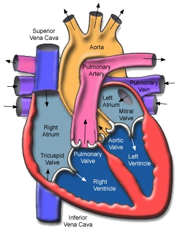{width="2.942361111111111in"
height="3.801388888888889in"}

Thus in a normal heart, under physiological conditions, continuous
synchronized contraction, ‘systole’ and relaxation, ‘diastole’ occur
along with pumping of blood from both atria into both ventricles and
from both ventricles away from the heart, generating first and second
heart sounds which is commonly described as “*lub-dub*”.

When under certain pathological conditions or when the valves become
narrow or stenosed on any dilatation or disease process, the
unidirectional haemodynamics may be altered, generating abnormal or
adventitious sounds called murmurs.

Clinicians auscultate the heart in its four different places i.e where
the valves are situated namely –

-   Mitral area

-   Tricuspid area

-   Aortic area

-   Pulmonary area

The ***Third Heart Sound (S3)*** also known as the “ventricular gallop”,
occurs just after S2 when the mitral valve opens allowing passive
filling of the left ventricle. The S3 sound is actually produced by the
large amount of blood striking a compliant left ventricle (LV).

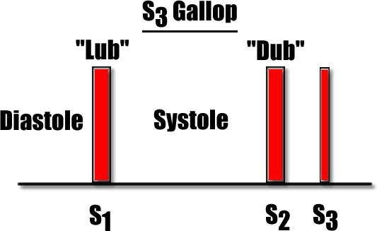{width="3.7083333333333335in"
height="2.275094050743657in"}

Figure 2:Ventricular
Gallop

The ***Fourth Heart Sound (S4)*** known as the “atrial gallop”, occurs
just before S1 when the atria contract to force blood into the LV. If
the LV is non-compliant and atrial contraction forces blood through the
AV valves, an S4 is produced by the blood striking the LV.

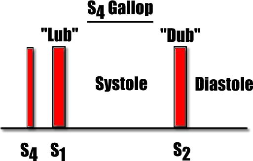{width="3.5706233595800523in"
height="2.0104166666666665in"}

Figure 3: Atrial Gallop

### Heart Murmurs

When under certain pathological conditions or when the valves become
narrow or stenosed on any dilatation or disease process, the
unidirectional haemodynamics may be altered, generating abnormal or
adventitious sounds called murmurs. Heart murmurs are produced as a
result of turbulent flow of blood strong enough to produce audible
noise. They are usually heard as a whooshing sound. The term murmur only
refers to a sound believed to originate within blood flow through or
near the heart; rapid blood velocity is necessary to produce a murmur.

### Diseases and their Characteristic sounds:

Rheumatic heart disease has become much less common in developed
countries. Degenerative valve disease (aortic stenosis, mitral
regurgitation due to chordal rupture) is increasingly common.

Heart murmurs are defined by four characteristics: loudness, quality,
location and timing.

The loudness of murmur reflects the degree of turbulence. This relates
to the volume and velocity of flow and not the severity of cardiac
lesion.

The quality of murmur relates to its frequency and is best described as
low, medium or high pitched. The quality of murmur on the chest walls
depends on its site of origin and has led to the description of four
valve areas. Clinicians auscultate the heart in its four different areas
i.e where the valves are situated namely –

1.  Mitral area

2.  Tricuspid area

3.  Aortic area

4.  Pulmonary area

Some murmurs radiate depending on the velocity and direction of blood
flow. The sound of the high-velocity systolic flow in aortic stenosis
and mitral regurgitation, for example, is directed towards the left
sternal edge.

Murmurs are timed according to the phase of systole or diastole during
which they are audible. It is inadequate to describe the timing of a
murmur and the phase of a systole or diastole during which it is heard;
systolic murmurs are either mid-systolic, pan systolic or late systolic;
diastolic murmurs are either early diastolic, mid-diastolic or
presystolic in timing.^\[1\]^

Continuous murmurs are audible in both phases of cardiac cycle. A
mid-systolic (‘ejection’) murmur is caused by turbulence in the left or
right ventricular outflow tract during ejection. It starts following
opening of the aortic or pulmonary valve, reaches a crescendo in
mid-systole and disappears before the second heart sound.

The murmur is loudest in the aortic area (with radiation to the neck)
when it rises from the left ventricular outflow tract, and in the
pulmonary area when it arises from the right ventricular outflow tract .
It is best heard with the diaphragm of the stethoscope while the patient
sits forward. Important causes of aortic ejection murmurs are
aortic stenosis.

Aortic Regurgitation also produces an ejection murmur due to the
increased stroke volume and velocity of ejection. Pulmonary ejection
murmurs may be caused by pulmonary stenosis or infundibula stenosis. Pan
systolic murmurs are audible throughout systole from the first to the
second heart sounds. They are caused by regurgitation through
incompetent atrio-ventricular valves and by ventricular septal defects.
The pan systolic murmurs of Mitral Regurgitation are loudest at the
cardiac apex and radiates into the left axilla. It is best heard using
the diaphragm of the stethoscope with the patient lying on the left
side.

The murmurs of Tricuspid Regurgitation and Ventricular Septal Defect are
loudest at the lower left sternal edge. Mitral valve prolapse may also
produce a pan systolic murmur but, more commonly, prolapse occurs in
mid-systole, producing a click followed by a late systolic murmur.

Early diastolic murmurs are high-pitched and start immediately after the
second heart sound, fading away in mid-diastole. They are caused by
regurgitation through incompetent aortic and pulmonary valves and are
beat heard using the diaphragm of the stethoscope while the patient
leans forward.

Pulmonary Regurgitation is loudest at the pulmonary area. Mid-diastolic
murmurs are caused by turbulent flow through the atrio-ventricular
valves. They start after valve opening, relatively late after the second
sound, and continue for a variable period during the mid-diastole.

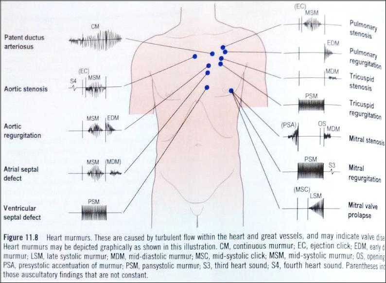{width="6.510416666666667in"
height="4.197916666666667in"}

Mitral stenosis is the principal cause of a mid-diastolic murmur which
is best heard at the cardiac apex using the bell of the stethoscope
while the patient lies on the left side. In Mitral or Tricuspid
Stenosis, atrial systole produces a presystolic murmur immediately
before the first heart sound. The murmur is perceived as an accentuation
of the mid-diastolic murmur associated with these conditions. Continuous
murmurs are heard during systole and diastole, and are uninterrupted by
valve closure.

The most common cardiac cause is Patent Ductus Arteriosus, in which flow
from the high-pressure aorta to the low-pressure pulmonary cycle,
producing a murmur over the base of the heart which, though continuously
audible, is loudest at end systole and diminishes during
diastole.Stenosis of the aortic valve is another common heart murmur, a
systolic ejection murmur. This is more common in older adults or in
those individuals having a two, not a three leaflet aortic valve. Other
audible murmurs are associated with abnormal openings between the left
ventricle and right heart or from the aortic or pulmonary arteries back
into a lower pressure heart chamber.

{width="7.309722222222222in"
height="6.944444444444444e-3in"}

Physicians have always used patients' chest sounds for diagnosis of
diseases. This practice can be tracked back to 1500 B.C. But, it was not
until the dusk of the 18th century, when a French doctor named René
Théophile Hyacinthe Laënnec (1781–1826) methodically investigated the
clinical meanings of both breath and heart sounds. To listen to the
sounds of the heart and lungs, he used a simple hollow wooden or an
ebony tube. Stethoscope was derived from its Greek roots where ‘stethos’
means chest and ‘skopein’ means to observe or to look at. René
understood that the time-honoured method of placing one's ear directly
over a patient's chest to be both inadequate and unpleasant. Also, the
sounds recorded were muffled when they were recorded from the chests of
obese people. Also, many were grimy and lice-ridden, where hygiene was
of concern. He hence auscultated (from the Latin auscultare, "to
listen") using a hollow tube, which he named “stethoscope”. He also
documented that his invention was inspired by the fact that sound is
"transported through certain solid bodies, as when we hear the scratch
of a pin at one end of a piece of wood, on applying our ear to the
other."

For the next few years, Laënnec experimented with a series of hollow
tubes that he fashioned out of cedar or ebony, arriving at a model
approximately one foot in length and 1.5 inches in diameter, with a
1/4-inch central channel. With this improved tool, he was able to
accurately diagnose a number of lung and heart diseases. He had later
compiled his findings in his book, “De l'Auscultation Médiate(1819)”.
With each passing decade, advances in acoustics and audiology have
changed the shape and look of the stethoscope. But it still remains one
of the iconic symbols of medicine.

Trained and eminent clinicians can easily identify the timing nature of
these adventitious sounds and can diagnose very easily what the
underline pathological process is. Modern medicine’s arsenal of
non-invasive imaging techniques affords even more stunning glimpses into
the human body. A doctor's auscultation skill can be gained only after
he or she experiences lots of cases of heart diseases and heartbeat
sounds.

Hence, the project aims at assisting a young and less trained internee
who is not very well acquainted to identify these abnormal adventitious
sounds and murmurs. There is a need of computer-aided equipment to
analyze heartbeat sound especially for young doctors to gain a quick
learning process. Various recordings of available pathological and
abnormal sounds with specific nomenclature are incorporated into one
system for analysis. For this purpose, we need accurate and dependable
equipment for heartbeat analysis. The hardware and software component
used is convenient and accessible that one can monitor his/her heart
condition without having an ECG machine. This also makes self-diagnosis
possible.

CHAPTER II: PROJECT DESCRIPTION AND GOALS
=========================================

A patient’s heart sound plays an important role in the primary
diagnosis, prognosis and survival analysis of heart diseases. The heart
signal contains an important amount of information that can be used in
different comportments. It allows for the analysis of anatomic and
physiologic aspects of the whole cardiac muscle. Hence, it is possible
for only proficient and renowned clinicians to easily identify the
timing nature of adventitious sounds caused by heart called murmurs and
can diagnose very easily what the underlined pathological process is. A
young and less trained doctor who is not very well acquainted to
identify these abnormal adventitious sounds and murmurs requires an
automated system for Cardio Diagnosis. Present day, there exists no
system which can recognize a heart disease automatically after hearing
to the heart beat sounds. Hence, a system that can replace a
conventional stethoscope is necessary. A system that can ease the
diagnosis for medical practitioners at basic levels, like students and
junior doctors, is required.

To improve the heartbeat analysis, initially the entire sound is
separated into sequences containing two major beat sequences, which are
referred as S1 and S2 and then the signal is correlated with the normal
heart beat signal. The heart sounds were recorded from a stethoscope
using a microphone and were amplified. However when the heart beats were
recorded, many kinds of noises were also recorded. When heart sound
analysis is considered manually, the slight variations occurring due to
the noises are neglected. But these noises can make clinical diagnosis
very difficult in the case of automated machines. Hence, in automated
machines the baseline must be very clearly defined. So it is important
to get signal parameters without the noises. Since the signals are
non-stationary in nature, it is difficult to visually analyze them. This
unwanted information has to be removed by a process known as denoising.
In this project, signal denoising (signal conditioning) of the database
signals and the test signals has been performed. The detection of the
state of heart (signal processing) is done by using a Digital Signal
Processor (DSP) (DSK6713). Processing of heart signal is manifold and
requires improvement of measurement accuracy and reproducibility (when
compared with manual measurements). DSPs provide a low-cost system
support. They are concerned primarily with real time signal processing
where the processing has to keep pace with some external events, whereas
non-real-time processing has no such timing constraint. The external
event to keep pace with is usually the analog input. Whereas analog
based systems with discrete electronic components such as resistors can
be more sensitive to temperature changes, causing vital part losses.
DSP-based systems are less affected by environmental conditions since it
is completely digitized. Also, working of analog components under high
frequency is unpredictable. As the DSPs are designed and optimized for
implementation of various DSP algorithms, most processors share various
common features to support the high performance, repetitive, numeric
intensive tasks.

CHAPTER III: TECHNICAL SPECIFICATIONS
=====================================

1.  

2.  

3.  

    1.  HARDWARE
        --------

        1.  ### TMS320C6713.

The DSK package is powerful, comparatively economical, given the
necessary hardware and software support tools for real-time signal
processing . It is a complete DSP system. The DSK board, with an
approximate size of 5 × 8 inches. shown in Figure.3:1, includes the
C6713 floating-point digital signal processor and a 32-bit stereo codec
TLV320AIC23 (AIC23) for input and output. The onboard codec AIC23 uses a
sigma–delta technology that provides ADC and DAC. It connects to a
12-MHz system clock. Variable sampling rates from 8 to 96 kHz can be set
readily. A daughter card expansion is also provided on the DSK board.
Two 80-pin connectors provide for external peripheral and external
memory interfaces.

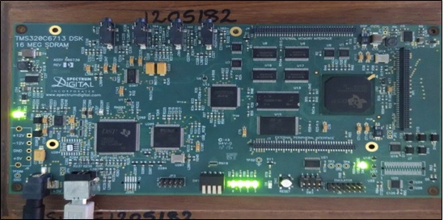{width="5.71875in" height="2.84375in"}

Figure 5:TMS320C6713

The DSK board includes 16 MB (megabytes) of synchronous dynamic random
access memory (SDRAM) and 256kB (kilobytes) of flash memory. Four
connectors on the board provide input and output: MIC IN for microphone
input, LINE IN for line input, LINE OUT for line output, and HEADPHONE
for a headphone output (multiplexed with line output). The DSK operates
at 225MHz.

The internal program memory is structured so that a total of eight
instructions can be fetched every cycle . Features of the C6713 include
264 KB of internal memory shared between program and eight functional or
execution units composed of six arithmetic-logic units (ALUs) and two
multiplier units, a 32-bit address bus to address 4 GB (gigabytes), and
two sets of 32-bit general purpose registers. DSK delivers 1800 million
instructions per second (MIPs) and 1350 MFLOPS.

The C6713 is capable of both fixed- and floating point processing with
32 bit integer support. JTAG emulation through on-board JTAG emulator
with USB host interface.An included 5V external power supply is used to
power the board.

Code Composer communicates with the DSK through an embedded JTAG
emulator with a USB host interface. The DSK can also be used with an
external emulator through the external JTAG connector.

#### Multichannel Buffered Serial Port:

*Multichannel Buffered Serial Port* is one of the important peripherals
of this processor :

The C62x/C67x McBSP is based on the standard serial port interface found
on the TMS320C2000 and C5000 platforms.

The standard serial port interface provides:

-   Full-duplex communication.

-   Double-buffered data registers, which allow a continuous
    data stream.

-   Independent framing and clocking for reception and transmission.

-   Direct interface to industry-standard codecs, analog interface chips
    (AICs), and other serially connected A/D and D/A devices.

-   External shift clock generation or an internal programmable
    frequency shift clock and multichannel transmission and reception of
    up to 128 channels.

-   An element sizes of 8-, 12-, 16-, 20-, 24-, or 32-bit.

-   8-bit data transfers with LSB or MSB first.

-   Highly programmable internal clock and frame generation.

DSK6713 can handle different tasks, since they can be reprogrammed
readily for a different applications. As the DSPs are designed and
optimized for implementation of various DSP algorithms, most processors
share various common features to support the high performance,
repetitive, numeric intensive tasks. Its important features include:

#### MACs and Multiple Execution Units

The most commonly known and used feature of a DSP is the ability to
perform one or more multiply-accumulate operation (also called as
“MACs”) in a single instruction cycle. The MAC operation is useful in
DSP algorithms that involve computing a vector dot product, such as
digital filters, correlation, and Fourier transforms. The MAC operation
becomes useful as the DSP applications typically have very high
computational requirements in comparison to other types of computing
tasks, since they often must execute DSP algorithms (such as FIR
filtering) in real time on lengthy segments of signals sampled at 10-100
KHz or higher. To facilitate this DSPs often include several independent
execution units that are capable of operating in parallel.

#### Efficient Memory Access

When a small group of instructions is executed repeatedly, the cache is
loaded with these instructions thus making the bus available for data
fetches, instead of instruction fetches. Due to Harvard architecture in
DSPs, i.e. physically separate storage and signal pathways for
instructions and data, and pipelined structure the processor is able to
fetch an instruction while simultaneously fetching operands and/or
storing the result of previous instruction to memory. DSPs also share a
feature of efficient memory access i.e. the ability to complete several
accesses to memory in a single instruction cycle.

#### Circular Buffering

The need of processing the digital signals in real time, where in the
output (processed samples) have to be produced at the same time at which
the input samples are being acquired, evolves the concept of Circular
Buffering. Circular buffering allows processors to access a block of
data sequentially and then automatically wrap around to the beginning
address exactly the pattern used to access coefficients in FIR filter.
Circular buffering also very helpful in implementing first-in, first-out
buffers, commonly used for I/O and for FIR delay lines.

#### Specialized Instruction Sets

The instruction sets of the digital signal processors are designed to
make maximum use of the processors‟ resources and at the same time
minimize the memory space required to store the instructions. Maximum
utilization of the DSPs‟ resources ensures the maximum efficiency and
minimizing the storage space ensures the cost effectiveness of the
overall system. To ensure the maximum use of the underlying hardware of
the DSP, the instructions are designed to perform several parallel
operations in a single instruction, typically including fetching of data
in parallel with main arithmetic operation.

### ESA MCB 51 Kit

The ESA MCB 51 board requires +5V power and a serial connection to a

PC running Keil µVision debugger. ESA MCB 51 can be operated with
AT89C51ED2 or AT89C51RD2 micro controller.

#### 

#### Specifications

#### Processor

· AT 89C51ED2 / RD2 operating at 11.0592 MHz

#### Processor features

On-Chip Memory:

-   CODE MEMORY: 64K Bytes of flash.

-   DATA MEMORY: 256 Bytes of RAM.

-   1792 Bytes of XRAM.

-   2K Bytes of EEPROM.

#### On-Chip Peripherals

-   16-bit Timers/Counters.

-   Watch Dog Timer.

-   Programmable Counter Array (PCA) on Port1 i.e. PWM and Capture
    & Compare.

-   SPI (Serial Peripheral Interface) on Port1.

-   Full duplex enhanced UART.

#### Interrupts

Nine sources of interrupt (both external and internal).

Two External interrupts INT0 and INT1 are provided with push button
switches;

these can also be used as general-purpose switches.

#### Interface Signals

CPU:

All the CPU signals available on a 40-pin connector site.

I/O (Port) Lines:

P0, P1 and P2 Port lines are available on a 26-pin connector,

compatible to ESA Interface Modules.

Four 10-pin connectors for all the 32 I/O lines.

LCD:

LCD compatible signals are available on a 16 Pin flow strip connector.

SERIAL I/O:

The trainer uses the on-chip flash monitor to communicate with Keil
Vision Debugger. The Flash monitor allows the user to program and debug
the on-chip code. The monitor uses the on-chip UART to communicate with
mVision Debugger.

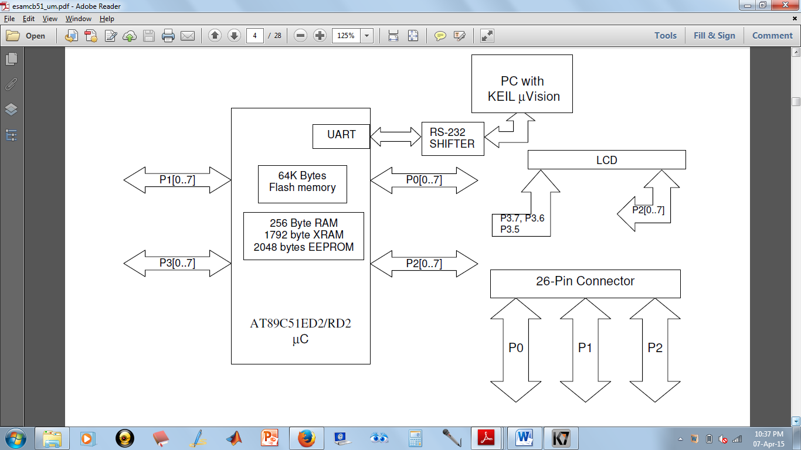{width="4.729166666666667in"
height="2.7708333333333335in"}

Figure 6: ESA MCB 51 Kit
– Block Diagram

1.  SOFTWARE
    --------

    1.  ### Code Composer Studio\

Code Composer Studio is an integrated development environment (IDE) that
supports TI's Microcontroller and Embedded Processors portfolio. Code
Composer Studio comprises a suite of tools used to develop and debug
embedded applications. It includes an optimizing C/C++ compiler, source
code editor, project build environment, debugger, profiler, and many
other features. The C compiler compiles a C source program with
extension .c to produce an assembly source file with extension .*asm*.
The assembler assembles an *.asm* source file to produce a machine
language object file withextension*.obj*. The linker combines object
files and object libraries as input to produce an executable file with
extension *.out*. To connect CC Studio with DSK kit, click Debug,
Connect as shown in Fig. 15. Then create an application project as seen
in Fig. 16 and can “add” the appropriate files to the project such as
libraries, hello.cmd, source file, support files etc. Compiler/linker
options can readily be specified.

After writing the code, the next step is to compile the code to machine
language. Then go to Project Build‟. The Build command will compile all
the files that are included in this project and make an executable file
for the DSP. A number of debugging features are available, including
setting breakpoints and watching variables; viewing memory, registers,
and mixed C and assembly code; graphing results; and monitoring
execution time. Real-time analysis can be performed using RTDX allows
for data exchange between the host PC and the target DSK, as well as
analysis in real time without stopping the target. Key statistics and
performance can be monitored in real time.

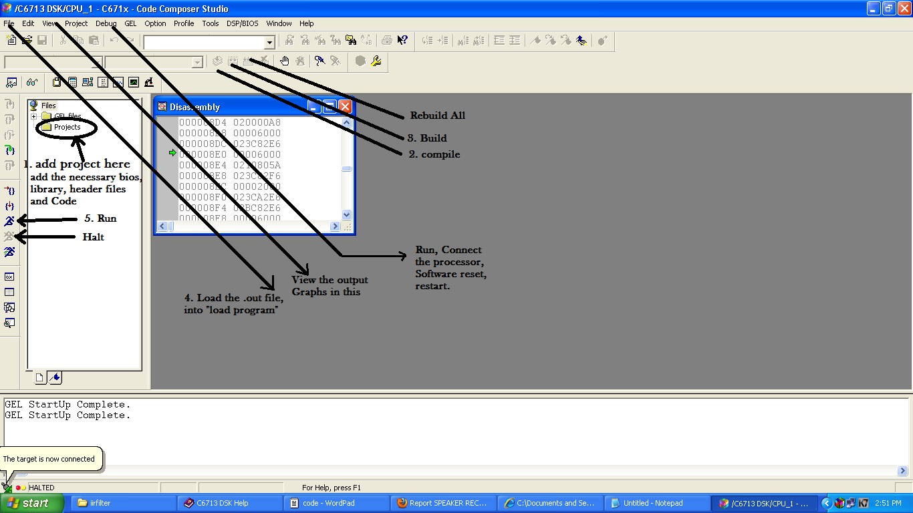{width="6.235849737532808in"
height="4.878386920384952in"}

Figure 7: CC Studio -
Steps

Useful Types of Files

-   file.pjt: to create and build a project named file.

-   file.c: C source program.

-   file.asm: assembly source program created by the user, by the C
    compiler, or by the linear optimizer.

-   file.sa: linear assembly source program. The linear optimizer uses
    *file.sa* as input to produce an assembly program *file.asm*

-   file.h: header support file.

-   file.lib: library file, such as the run-time support library file
    rts6700.lib

-   file.cmd: linker command file that maps sections to memory.

-   file.obj: object file created by the assembler.

-   file.out: executable file created by the linker to be loaded and run
    on the C6713 processor.

-   file.cdb: configuration file when using DSP/BIOS.

Support files

-   C6713dskinit.c: contains functions to initialize the DSK, the codec,
    the serial ports, and for I/O. It is not included with CC Studio.

-   C6713dskinit.h: header file with function prototypes. Features such
    as those used to select the mic input in lieu of line input (by
    default), input gain, and so on are obtained from this header file.

-   C6713dsk.cmd: sample linker command file. This generic file can be
    changed when using external memory instead of internal memory.

-   Vectors\_intr.asm: a modified version of a vector file included with
    CCS to handle interrupts. Twelve interrupts, INT4 through INT15, are
    available, and INT11 is selected within this vector file. They are
    used for interrupt-driven programs.

-   Vectors\_poll.asm: vector file for programs using polling.

-   rts6700.lib, dsk6713bsl.lib, csl6713.lib: run-time, board, and chip
    support library files, respectively.

-   These files are included with CCS and are located in
    C6000\\cgtools\\lib, C6000\\dsk6713\\lib, and
    c6000\\bios\\lib respectively.

-   Finally, to run the program, load the program into the DSP. Go to
    File Load Program.

-   Load the executable file (.out) that the compiler generated as seen
    in Fig 17 (generally in the Debug directory of the project) and then
    run the loaded file.

Through the JTAG, communication with on-chip emulation support occurs to
control and monitor program execution. The C6713 DSK board includes a
JTAG interface through the USB port.

### MATLAB

MATLAB is a high performance language for technical computing. The
fundamental milestone of this project is investigation and
implementation of the removal of noise from heart beat sound signal and
extract the features necessary for comparison. The MATLAB software
provides a variety of functions that makes it easy and flexible while
simulating for interactive designing, advance analyzing, exploration and
visualizing signals, filters and windows. It provides tools for finite
impulse response (FIR) and infinite impulse response (IIR) digital
filters’ - design, implementation and analysis. It also provides the
toolbox for application such as speech and audio processing, medical
imaging and instruction, wired & wireless communication and financial
modeling and analysis. MATLAB has set of construct for plotting
scientific graphs from raw or computed data.

The Signal processing toolbox of MATLAB provides functions to generate,
measure, transform, filter and visualize signals. The toolbox includes
algorithms for resampling, smoothing and synchronizing signals,
designing and analysing filters, estimating power spectra, and measuring
peaks, bandwidth, and distortion. With the help of this, trends in
signals can be analysed and compared in time, frequency and time
frequency domains, patterns and trends can be compared, features can be
extracted and algorithms can be developed, validated and customized to
gain insight into our data.

Here, for our project work, MATLAB (R2009a) software was used for
initially conditioning the signal and denoising it. The features for
comparison were hence extracted after the conditioning.

#### **Filter Design and Analysis Tool**

MATLAB‟s filter design and analysis tool can be invoked by typing

> &gt;&gt; “*fdatool’’*

The Filter Design and Analysis Tool (FDATool) is a powerful user
interface for designing and analyzing filters quickly. FDATool enables
quick design of digital FIR or IIR filters by setting filter performance
specifications, by importing filters from MATLAB workspace, or by
adding, moving or deleting poles and zeros. FDATool also provides tools
for analyzing filters, such as magnitude and phase response and
pole-zero plots. The values and specifications are provided to design
the required filter as given in the below fdatool box.

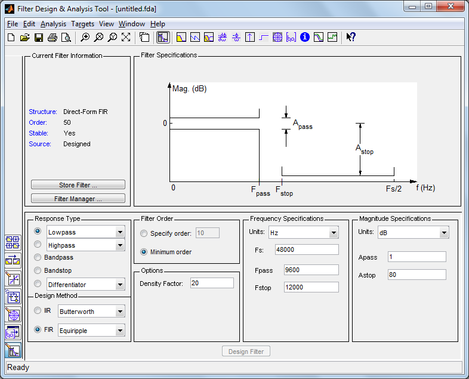{width="3.405660542432196in"
height="2.751453412073491in"}

Figure 8: FDATOOL

Filter coefficients are exported to our project in CCS by generating an
ANSI C header file that contains those coefficients. The header file
defines global arrays for the filter coefficients. When you link the
project to the header file, the linker allocates the global arrays in
static memory locations in processor memory. Loading the executable
file, the processor allocates enough memory to store the exported filter
coefficients in its memory and writes the coefficients to the allocated
memory and further exports to CC Studio.

#### Designing a filter using FDATOOL:

Several responses can be chosen as per the necessary conditions from the
list below -

Low-pass, Raised cosine, High-pass, Band-pass, Band-stop,
Differentiator, Multiband, Hilbert transformer, Arbitrary magnitude.

Additional response types are available if DSP System Toolbox™ software
is installed. For example, to design a bandpass filter, select the radio
button next to **Bandpass** in the Response Type region of the GUI. The
default filter design method for the response type that you've selected
can be used or a filter design method from the available FIR and IIR
methods listed in the GUI can be selected. After this, the filter
specifications and filter order have to be set.

Any of the following filter response characteristics can be displayed
either in the response region or in a separate window.

-   Magnitude response

-   Phase response

-   Magnitude and Phase responses

-   Group delay response

-   Phase delay response

-   Impulse response

-   Step response

-   Pole-zero plot

-   Zero-phase response — available from the *y*-axis context menu in a
    Magnitude or Magnitude and Phase response plot.

    1.  ### Keil µVision

Typical layout of the flash monitor and Keil debugger is as follows.

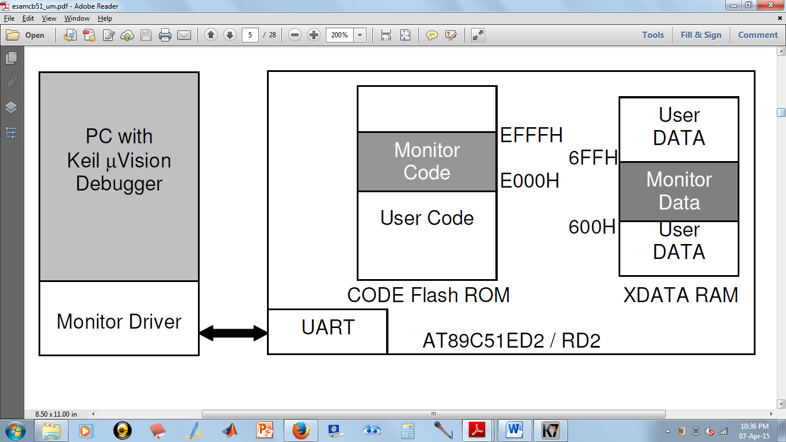{width="5.59375in"
height="2.5416666666666665in"}

Figure 9: Keil Debugger

On-Chip UART signals are available through MAX 232 on a RJ-11 connector.
The ESA MCB 51 is built around AT89C51ED2/RD2; this board provides a
platform to user to evaluate the on-chip features of 8051 family
microcontrollers. The 32 I/O lines of the microcontroller are available
to user on different connectors. A 16x2 LCD, which is interfaced to 11
port lines, is available to user. The on-chip UART is used tointerface
the board with PC.

### LCD interface with Keil

A 16x2 LCD is interfaced to the port lines of MCU.

.

#### Description of the LCD Module

LCD accepts characters in ASCII format. Character display font in LCD
module is by matrix of dots i.e. each character in LCD module can be
represented by 7x5 matrix (7 rows and 5 columns of dots) or 10x5 matrix
(10 rows and 5 columns of dots). This interface is built over 16x2 LCD
module in which the display data RAM address of LCD module for the first
line starts from 00H to 14H and the second line starts from 29H to 3CH.

#### 

#### LCD Pin Description and Interface to MCU

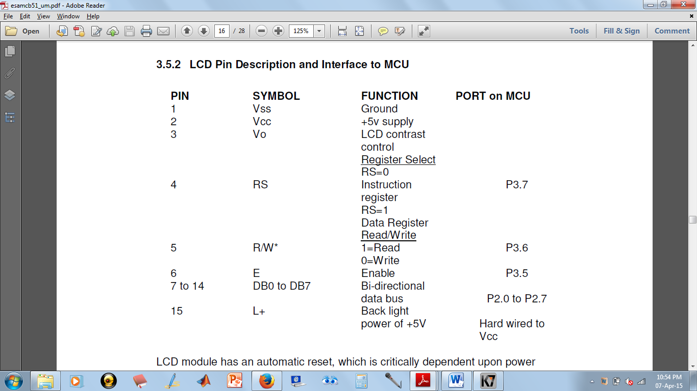{width="4.75in"
height="3.0275984251968504in"}

Figure 10: LCD
Description

LCD module has an automatic reset, which is critically dependent upon
power supply voltage. Voltage has to rise from 0.2V to 5V within 10 to
15ms for the LCD to reset. Since this is not accurate we choose to give
some delay in the application program while initializing it. The Busy
Flag of the LCD module will be set while LCD is resetting and also when
data or command has been written. At this time user cannot write on to
the LCD module. Data can be written on to the module only when busy flag
goes low.

#### Configuration and Installation

The ESA MCB 51 board requires +5V power and a serial connection to a PC
running Keil µVision debugger. After the Power up, the board can be
connected to Keil IDE to download and execute the user programs. The
Keil Monitor-51 Driver is used to download the user application code
into on-chip flash, and also to debug the downloaded user application
code.

#### Integration with KEIL: Settings to be made

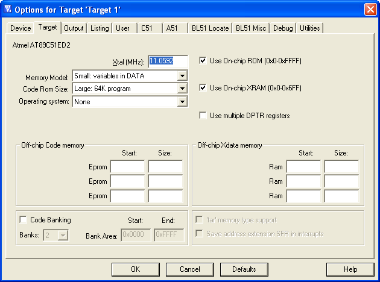{width="6.0in"
height="4.456410761154856in"}

Figure 11: Options for
Target in Keil

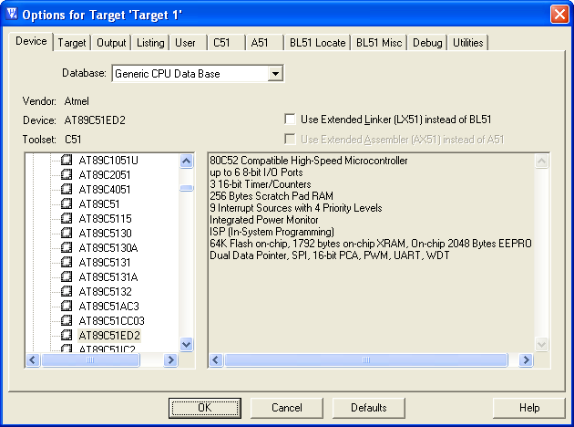{width="6.0in"
height="4.456410761154856in"}

Figure 12:
Microcontroller/ Microprocessor - Device Selection in Keil

CHAPTER IV: DESIGN APPROACH AND DETAILS
=======================================

1.  

<!-- -->

1.  

2.  

3.  

    1.   MODULE 1: *Signal Conditioning:* Amplification of Heart Sound and Noise Filtering 
        -----------------------------------------------------------------------------------

***Hardware:***

### Prototype I:

**Audio Amplifier:**

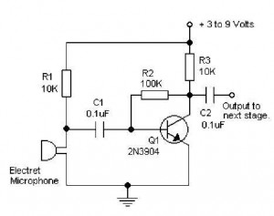{width="2.865384951881015in"
height="2.7229461942257216in"}

Figure 13: Preamplifier
Circuit

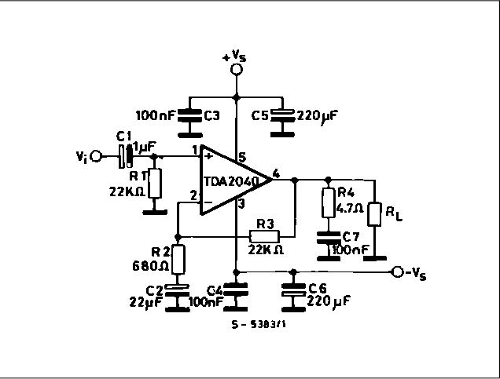{width="4.25in"
height="2.723183508311461in"}

Figure 14: Amplifier
Circuit

#### Circuit Characteristics:

-   The electret microphone is attached inside the tubes of
    the stethoscope.

-   Stethoscope sounds are given as input to the preamplifier circuit
    which is driven by a 5 V DC supply.

-   The preamplifier circuit essentially reduces the effects of noise
    and interference.

-   It is used to boost the signal strength to drive the cable to the
    main instrument without significantly degrading the signal-to-noise
    ratio (SNR).

-   The preamplifier provides voltage gain (from 10 millivolts to
    1 volt) but no significant current gain.

-   The output of the preamplifier circuit is connected to the pin 1 of
    TDA2040 which takes the input through a capacitor.

-   TDA2040 is a class AB power amplifier. The TDA2040 provides high
    output current and has very low harmonic and crossover distortion.
    It also has a built in circuitry for short circuit protection.

-   Pin 5 and 3 are connected to +12V and -12V DC supply.

-   The output is taken at pin 4 of the IC using a speaker, which in a
    later stage will be given as an input to MATLAB for
    signal comparison.

**TESTING****:**

### Real Time constraints faced:

-   The voltage level of the recorded heart sounds is of the order
    10^-6^. So a very huge gain is necessary in order to record the
    heart sounds.

-   The microphone was too sensitive to ambient noise and lesser
    sensitive to the heart sound. Though the audio amplifier circuit
    could amplify signals of amplitude 0.5mV, it wasn’t sensitive enough
    to amplify the heart sounds.

-   When a lowpass filter was applied across the input before
    amplification, the noise was reduced but the amplifier wasn’t able
    to amplify the heart sounds.

-   A huge attenuation in the amplitude of the input signal was observed
    when the order of filter was increased to make a steep filter.

    1.  ### Prototype II:

**Heart Sound - Signal Conditioning Circuit**

{width="6.673077427821522in"
height="3.2019225721784776in"}

Figure 15: Signal
Conditioning Circuit with LM386

Circuit Characteristics:

-   The signal conditioning circuit consists of two elements, audio
    amplifier (LM386) and filtering circuit.

-   The amplification of this circuit is set to be maximum of 5Vp with
    frequency filtering is set to 10Hz using an analog passive filter.

-   The analog passive filter used was a low-pass filter of cut-off
    frequency 10 Hz.

    1.  ### Real Time Constraints:

-   noise was removed but heart sounds were not audible.

    1.  ### ***Prototype*** III:

<!-- -->

-   The tube of a stethoscope with 4-5 mm inner diameter was cut in
    length of 10-12cm, and a small condenser microphone (SONY)
    was inserted.

-   The sounds were directly recorded to the computer through a
    collar MIC.

-   The sounds were recorded in a very quiet environment where all the
    environmental noises were minimised.

-   A filter of 20-250 Hz was applied to separate the heart sounds from
    the environmental noises. It was further amplified by multiplying
    with a scalar multiple 100.

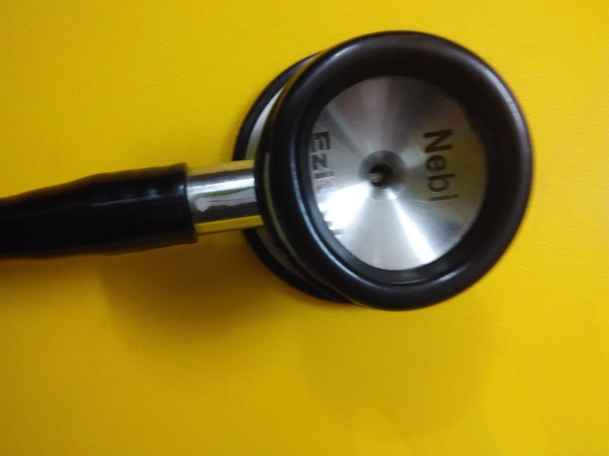{width="4.389224628171479in"
height="3.1041666666666665in"}

Figure 16: Tuning the
stethoscope between bell and diaphragm

### Real Time constraints: 

-   The stethoscope has to be tuned in between the bell and the
    diaphragm to record the heart beats. Initial tuning of the
    Stethoscope is very crucial to record sounds. When the Stethoscope
    is tuned either to diaphragm or bell completely, the sounds couldn’t
    be recorded due to presence of very prominent noise.

-   The sensitivity of the collar mike is very high. The microphone is
    inserted inside the rubber tube of the stethoscope. Hence, noise
    becomes very loud even if the tube is touched.

    1.  MODULE 2: Analysis of the of pre-recorded abnormal and normal cases using MATLAB
        --------------------------------------------------------------------------------

The goal of this module is to develop an algorithm for detecting and
classifying murmurs. The analysis has been made on 138 various heart
sounds. Hence to differentiate between the heart sounds, Stochastic and
energy estimations have been carried out in the algorithm. From the
frequency estimates, the energy was also calculated. The procedure
suggested would provide the display of the heart sound with respect to
the time, the category of the murmurs and the types of common heart
disorder faced by the patient. The data collected from the stethoscope
is processed and analysed. It allows early detection of the common heart
disease, and a person does not need to be in the hospital to get them
checked.

### Prototype I: Using Energy estimate to classify the signals

#### Algorithm

TRUE FALSE

**Explanation:**

We use percentile energy as an initial mode of classification. It tells
if a signal is abnormal or normal. According to the assumption, the
percentile energy of every frame should be constant and that energy
should be compared to that of the test signal’s. As per the algorithm,
we calculate percentile energy by dividing the total energy per frame
with total energy of the signal. This percentile energy calculated is
used for comparison between the signals.

####  Results

*2 Beats per frame:*

Test Signal: 04 Apex, Mid Sys Click, Supine, ll\_0.00-0.08.wav

totaltime = 8.9088 %in Seconds

totalenergy = 1.8778e+009 %total energy of the signal = \[abs(fft)\]2

percentile\_frame = 0.0049 0.0077 0.0031 0.0079 0.0079 0.0049 0.0079

Percentile Energy calculated per frame, where each frame consists of 2
beats)

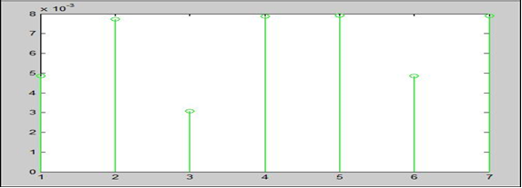{width="5.968055555555556in"
height="2.15625in"}

Figure 17: Energy
percentile calculation: test signal : 2beats per frame

Database signal:

02 Apex, Split S1, Supine, bell\_0.00-0.07.wav

fs = 44100 %Hz

totalenergy = 4.1233e+008

percentile\_frame = 0.0070 0.0066 0.0072 0.0108 0.0111 0.0098 0.0114

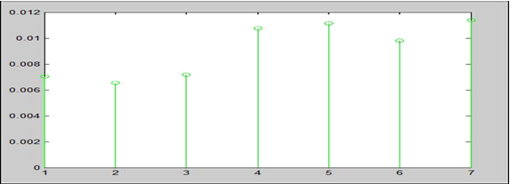{width="5.968055555555556in"
height="2.15625in"}

Figure 18: Energy
percentile calculation: database signal

*4 beats per frame:*

Test Signal: 05 Apex, S3, LLD, Bell\_part 5.1

totaltime = 9.0656 %in seconds

totalenergy =1.6814e+009

percentile\_frame = 0.0214 0.0229 0.0281 0.0227 0.0229

(Percentile Energy calculated per frame, where each frame consists of 4
beats)

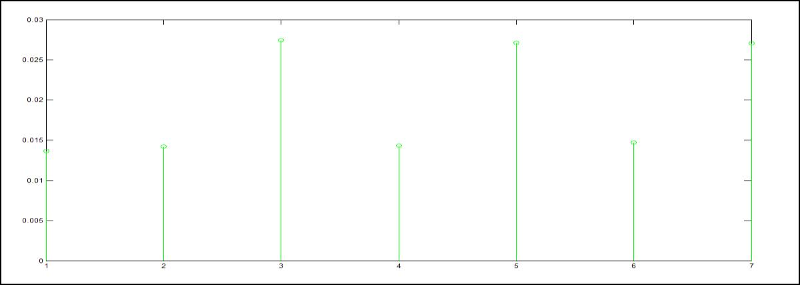{width="5.960416666666666in"
height="2.1506944444444445in"}

Figure 19: Energy
percentile Calculations, Test Signal

Database Signal: 06 Apex, Early Sys Mur, Supine, Bell\_part 6.1

totaltime =10.0582 %in seconds

totalenergy =5.6634e+008

percentile\_frame = 0.0137 0.0142 0.0275 0.0143 0.0271 0.0147 0.0271

{width="5.968055555555556in"
height="2.15625in"}

#### Conclusion:

1.  The energies of the signal per frame should be almost equal. But
    unlike that situation the energies of every frame is different.

2.  The ratio of energies of the test signal and the database signal
    should always be either greater than 1 or less than 1. But even this
    situation keeps changing for every frame. This means that the energy
    in one frame cannot be compared to energy in another frame.

3.  This procedure can at the most tell if the signal is abnormal
    or normal. It cannot be used to classify into specific category of
    any heart.

    1.  ### Prototype II: Using Stochastic Estimate(Correlation) to classify the signals.

#### Algorithm

TRUE FALSE

#### Explanation:

In signal processing, cross-correlation is a measure of similarity of
two series as a function of the lag of one relative to the other. This
is also known as a sliding dot product or sliding inner-product. It is
commonly used for searching a long signal for a shorter, known feature.
It also determines the similarity between two signals. For continuous
functions f and g, the cross-correlation is defined as:

$$………………………………….(1)

where f\* denotes the complex conjugate of f and
{width="0.10347222222222222in"
height="9.444444444444444e-2in"}is the lag. There are several
correlation coefficients, often denoted ρ or r, measuring the degree of
correlation.

#### Results:

The taken signal is an abnormal heart sound.

**Test Signal: 10 Apex, Sys Click & Late Sys Mur, LLD, Bell\_part
10.6.wav**

The signal is represented in its time domain. Every set of heart sounds
consists of S1,S2 and S3. Also there is another abnormality called
Click, which occurs after the systole. Like the name say, the murmur
occurs in the late systolic side.

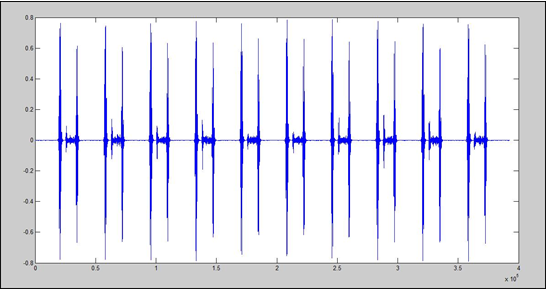{width="5.697222222222222in"
height="3.0097222222222224in"}

Figure 21: Signal in Time
domain

Figure 21 depicts the envelope of the signal before rectification. This
waveform is similar to that observed in an ECG. All the peaks and
valleys can be distinctly noted here.

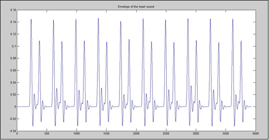{width="5.676388888888889in"
height="2.957638888888889in"}

Figure 22: Envelope of
the Signal

The Figure 22 depicts the rectified version of Figure 21. Here also, the
features of the abnormality can be distinctly noted.

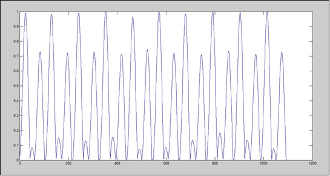{width="5.676388888888889in"
height="3.0305555555555554in"}

Figure 23: Rectified
signal for further peak detection

Figure 23 depicts the normalized version of figure 22. While recording
sounds there can be differences in the amplitudes. Hence to equalize all
those irregularities in amplitude, the signal is normalized.

{width="5.676388888888889in"
height="3.0305555555555554in"}

Figure 24: Normalized
signal

The signal is the divided into sets which consist of data from one S1 to
the next S1. This makes correlation more accurate because only required
features are compared, hence reducing the execution time .

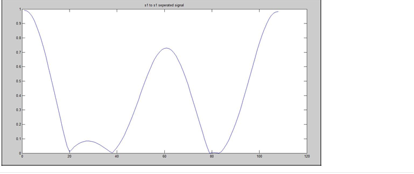{width="5.625in"
height="2.9166666666666665in"}

Figure 25: The separated
signal which will be used for correlation

A similar procedure is carried forward for the database signals as well.

Database Signal 1: **03 Apex, S4, LLD, Bell\_part 3.3**

{width="6.0in"
height="2.982128171478565in"}

Figure 26: 03 Apex, S4,
LLD, Bell\_part 3.3

Database Signal 2 : 04 Apex, Mid Sys Click, Supine, Bell\_part 4.5.wav

{width="6.0in"
height="3.2916666666666665in"}

Figure 27: 04 Apex, Mid
Sys Click, Supine, Bell\_part 4.5.wav

Database Signal 3 : 05 Apex, S3, LLD, Bell\_part 5.4.wav

{width="6.458333333333333in"
height="3.28125in"}

Figure 28: 05 Apex, S3,
LLD, Bell\_part 5.4.wav

Database Signal 4: 06 Apex, Early Sys Mur, Supine, Bell\_part 6.3.wav

{width="6.541666666666667in"
height="3.0208333333333335in"}

Figure 29: 06 Apex, Early
Sys Mur, Supine, Bell\_part 6.3.wav

Database Signal 5: 09 Apex, Holo Sys Mur, Supine, Bell\_part 9.1

{width="6.479166666666667in"
height="3.28125in"}

Figure 30: 09 Apex, Holo
Sys Mur, Supine, Bell\_part 9.1

Database Signal 6: 10 Apex, Sys Click & Late Sys Mur, LLD, Bell\_part
10.2.wav

{width="6.5in"
height="3.4895833333333335in"}

Figure 31: 10 Apex, Sys
Click & Late Sys Mur, LLD, Bell\_part 10.2.wav

Database Signal 7: 01 Apex, Normal S1 S2, Supine, Bell - Copy\_part
1.1.wav

{width="6.197916666666667in"
height="2.9479166666666665in"}

Figure 32: 01 Apex,
Normal S1 S2, Supine, Bell - Copy\_part 1.1.wav

As per the waveforms the maximum correlation should be with that of the
Last waveform.

The correlations seen are:

Assuming that code doesn’t give any false positives, the correlation
match has been categorized into 4 cases. Since a 99% match is set as
threshold and since the test signal can be either normal or diseased,
the output is divided into four cases-

{width="4.704094488188977in"
height="2.21875in"}

Figure 33: Notations
followed

Peaks: Value of the S1 peak; t : position at which it occurs

peaks1 = 0.9914 0.9818 0.9918 1.0000 0.9649 0.9997 0.9833 0.9986 0.9942
0.9977

t1 = 24 131 242 352 464 571 680 791 904 1014

peaks2 = 0.9857 0.9881 0.9880 1.0000 0.9784 0.9917 0.9763 0.9928 0.9984

t2 = 69 178 284 393 499 611 721 832 941

peaks3 = 0.9522 0.9914 1.0000 0.9898 0.9933 0.9898 0.9974 0.9835 0.9912
0.9812

t3 = 25 157 291 424 559 694 828 961 1096 1232

peaks4 = 0.9992 0.9636 0.9983 0.9569 0.9840 0.9826 0.9766 0.9732 0.9933
0.9658 0.9934 0.9527 0.9728 0.9632 0.9767 0.9738 0.9848 0.9624 1.0000
0.9695 0.9722

t4 = 25 111 157 244 290 378 426 513 559 646 692 780 825 912 958 1044
1089 117 1222 1309 1355

peaks5 = 0.9891 0.9948 0.9957 0.9910 0.9878 0.9969 0.9892 1.0000 0.9921
0.9894

t5 = 26 148 274 396 524 645 774 895 1022 1144

peaks6 = 0.9791 0.9809 0.9817 0.9800 0.9922 0.9754 0.9054 0.9802 0.9825
0.9785 1.0000

t6 = 26 141 266 389 512 629 705 759 882 1005 1129

peaks7 = 0.9617 0.9707 1.0000 0.9811 0.9763 0.9695 0.9765 0.9791 0.9812

t7 = 25 117 209 301 393 485 577 669 761

*10 Apex, Sys Click & Late Sys Mur, LLD, Bell\_part 10.1.wav *

Here the rows& columns represent the output match of different sets of
S1 to S1 correlated with different database signal sets.

cc1 =

11 11 11 11 11 11 11 11 11

11 11 11 11 11 11 11 11 11

11 11 11 11 11 11 11 11 11

11 11 11 11 11 11 11 11 11

11 11 11 11 11 11 11 11 11

11 11 11 11 11 11 11 11 11

11 11 11 11 11 11 11 11 11

*04 Apex, Mid Sys Click, Supine, Bell\_part 4.5.wav *

cc2 =

11 11 11 11 11 11 11 11

11 11 11 11 11 11 11 11

11 11 11 11 11 11 11 11

11 10 11 10 11 11 11 11

11 11 11 11 11 11 11 11

11 11 11 11 11 11 11 11

11 10 11 10 11 11 11 11

11 10 11 10 11 11 11 11

11 11 11 11 11 11 11 11

*03 Apex, S4, LLD, Bell\_part 3.3.wav *

cc3 = 10 10 10 10 10 10 10 10 10

10 10 10 10 10 10 10 10 10

10 10 10 10 10 10 10 10 10

10 10 10 10 10 10 10 10 10

10 10 10 10 10 10 10 10 10

10 10 10 10 10 10 10 10 10

10 10 10 10 10 10 10 10 10

*05 Apex, S3, LLD, Bell\_part 5.4.wav *

cc4 = 10 10 10 10 10 10 10 10 10 10 10 10 10 10 10 10 10 10 10 10

10 10 10 10 10 10 10 10 10 10 10 10 10 10 10 10 10 10 10 10

10 10 10 10 10 10 10 10 10 10 10 10 10 10 10 10 10 10 10 10

10 10 10 10 10 10 10 10 10 10 10 10 10 10 10 10 10 10 10 10

10 10 10 10 10 10 10 10 10 10 10 10 10 10 10 10 10 10 10 10

10 10 10 10 10 10 10 10 10 10 10 10 10 10 10 10 10 10 10 10

10 10 10 10 10 10 10 10 10 10 10 10 10 10 10 10 10 10 10 10

10 10 10 10 10 10 10 10 10 10 10 10 10 10 10 10 10 10 10 10

10 10 10 10 10 10 10 10 10 10 10 10 10 10 10 10 10 10 10 10

*06 Apex, Early Sys Mur, Supine, Bell\_part 6.3.wav *

cc5 =

10 10 10 10 10 10 10 10 10

10 10 10 10 10 10 10 10 10

10 10 10 10 10 10 10 10 10

10 10 10 10 10 10 10 10 10

10 10 10 10 10 10 10 10 10

10 10 10 10 10 10 10 10 10

10 10 10 10 10 10 10 10 10

10 10 10 10 10 10 10 10 10

10 10 10 10 10 10 10 10 10

*09 Apex, Holo Sys Mur, Supine, Bell\_part 9.1.wav *

cc6 =

11 10 10 10 11 10 10 10 10 10

11 10 10 10 11 10 10 10 10 10

11 10 10 10 11 10 10 10 10 10

11 10 10 10 11 10 10 11 10 10

11 10 10 10 10 10 10 10 10 10

11 10 10 10 11 10 10 10 10 10

11 10 10 10 11 10 10 10 10 10

11 10 11 11 11 10 10 11 11 10

11 10 10 10 11 10 10 10 10 10

*01 Apex, Normal S1 S2, Supine, Bell - Copy\_part 1.1.wav *

ccnormal =

101 101 101 101 101 101 101 101

101 101 101 101 101 101 101 101

101 101 101 101 101 101 101 101

101 101 101 101 101 101 101 101

101 101 101 101 101 101 101 101

101 101 101 101 101 101 101 101

101 101 101 101 101 101 101 101

101 101 101 101 101 101 101 101

101 101 101 101 101 101 101 101

***Conclusion: ***

1\. The maximum number of 11s are observed in the case of cc1 which
corresponds to waveform 10, which is in turn the correct waveform
identified.

2\. Hence the signal is identified as a Late systolic murmur, which
corresponds to a “MITRAL VALVE COLLAPSE”

 Module 4: Implementation on DSK6713 processor
----------------------------------------------

This module implements “Signal Conditioning” and “Analysis and
Comparision” modules in the Digital Signal Processor. The Module 3 has
been converted into C code to be possible for processing by the DSK6713
processor. Hence the algorithms for the correlation and signal
smoothening remain the same. As shown in Chapter 3, CCS has been used to
code in C Language which can be processed in DSK6713. The processor uses
DSK6713 AIC23 codec to handle the real time operations. The codec allows
the user to take input and give outputs through 3.5mm jacks either via
MIC IN/OUT and LINE IN/OUT. A MIC is fixed into the tube of the
stethoscope. This MIC output is given as an input to the AIC23 codec via
MIC IN. The DSK6713 cleanses the noise by filtering the signal in
between the range 2-250 Hz, to remove noise due to lungs sounds and
external environment. MATLAB’s FDATool is used to derive the
coefficients of the required filter for denoising the signal. Once the
denoised signal is thru, it is passed through a function to extract the
envelope of the signal. Once the envelope is taken, it is rectified and
the heart beat sets are separated from one maximum to the next maximum.
These sets of sounds are compared to the already separated sets,
extracted and exported from MATLAB to the processor’s memory. The
correlation is performed over the test signal and database sounds and
the output is taken based on the percentage match with the database
sounds. Based on the output, the DSK6713 writes appropriate binary code
relating to each case to its GPIOs. These GPIOs are connected to Port 1
of 89C51ED2 in the MCB ESB 51 board, through a voltage convertor to set
low of the output to 0V and high to 5V. The Port 1 of 8051 is configured
as an input port. The Port 2 of the LCD is the port which carries the
data and commands to LCD. P3.6,P3.7 and P3.5 of the board are used for
configuring the LCD to command or data display mode. Hence, based on the
inputs given by GPIOs of DSP into 8051, the 8051 takes the input from
Port 1 and displays the corresponding output via a switch case on the
LCD interfaced to 8051 in the board.

### Working Screenshot of the project

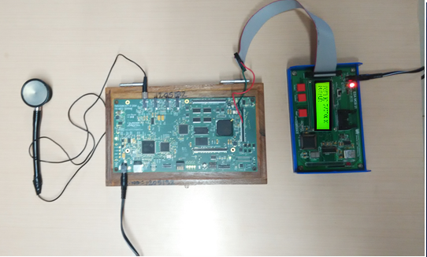{width="5.958333333333333in"
height="3.3229166666666665in"}

Figure 34: Working
Screenshot of the project

### Results:

The test signal has been obtained through MICIN of DSK6713. It has been
manually played in laptop. The acquired signal is then filtered in the
preprocessing module then sent for comparision through correlation
function.

**Test Signal:** X11: 10 Apex, Sys Click & Late Sys Mur, LLD, Bell\_part
10.1.wav

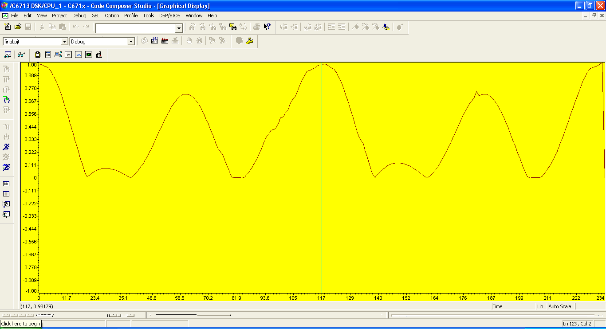{width="6.845187007874015in"
height="2.6549343832020997in"}

Figure 35: **Test
Signal:** X11: 10 Aortic, Sys Click & Late Sys Mur, LLD, Bell

The database signals are preprocessed and embedded into the code after
separating them into sets of heartbeats.

**Database Signal 1**: 04 Apex, Mid Sys Click, Supine, Bell\_part
4.5.wav

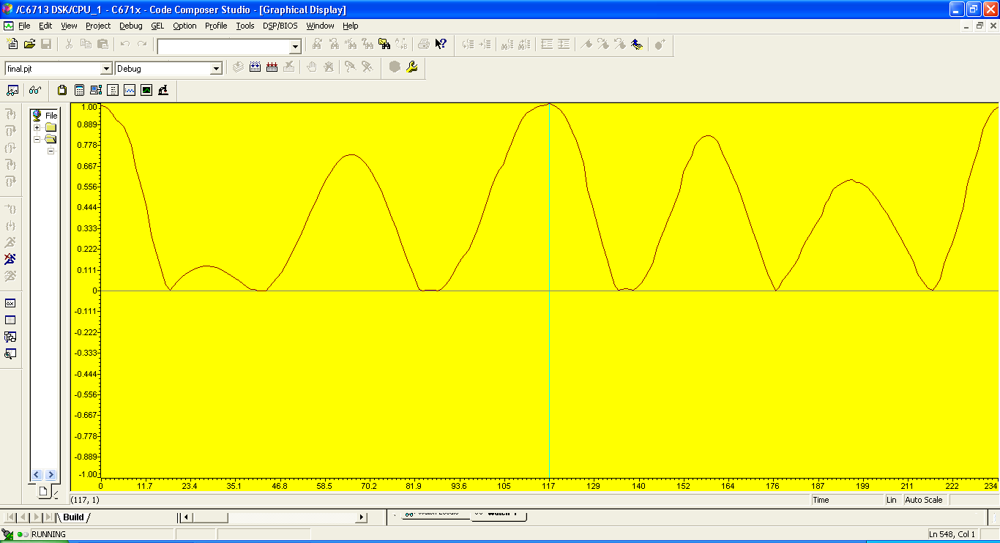{width="6.874359142607174in"
height="2.96875in"}

Figure 36: Database
Signal 1: 04 Apex, Mid Sys Click, Supine, Bell\_part 4.5.wav

**Database Signal 2:** 10 Aortic, Sys Click & Late Sys Mur, LLD,
Bell\_part 10.5.wav

{width="6.816321084864392in"
height="2.8125in"}

Figure 37: **Database
Signal 2:** 10 Apex, Sys Click & Late Sys Mur, LLD, Bell\_part 10.5.wav

**Database Signal 3**: 03 Apex, S4, LLD, Bell\_part 3.3.wav

{width="6.884975940507436in"
height="2.7604166666666665in"}

Figure 38: **Database
Signal 3**: 03 Apex, S4, LLD, Bell\_part 3.3.wav

**Database Signal 4**: 05 Apex, S3, LLD, Bell\_part 5.4.wav

{width="6.404494750656168in"
height="2.7604166666666665in"}

Figure 39: Database
Signal 4: 05 Apex, S3, LLD, Bell\_part 5.4.wav

The results obtained after correlating the test signal with Database
signals.

#### Correlation with Database signal 1:

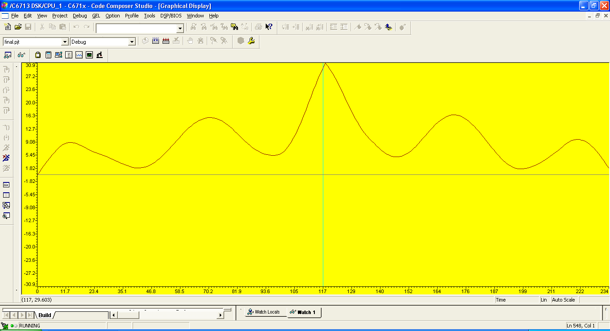{width="6.395833333333333in"
height="2.9479166666666665in"}

Figure 40: Correlation
with Database signal 1:

**Max correlation value noted: 30.8712**

#### Correlation with Database signal 2:

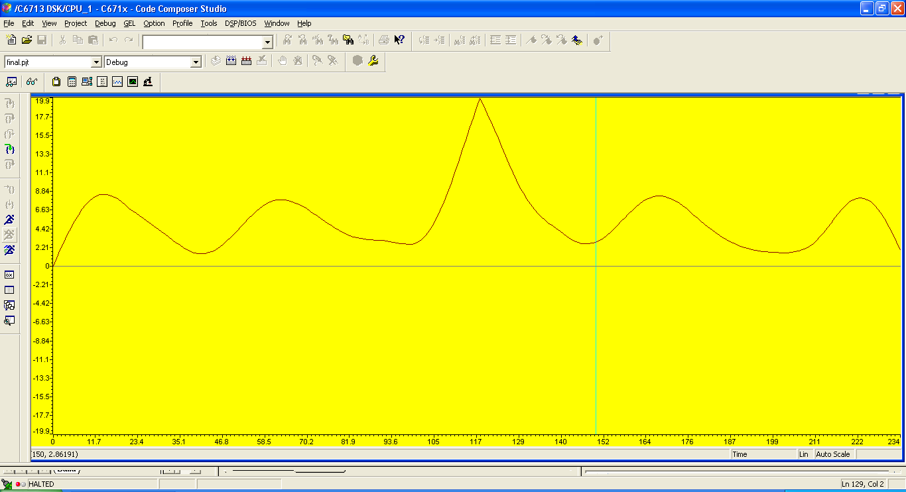{width="6.935498687664042in"
height="2.8958333333333335in"}

Figure 41: Correlation
with Database signal 2:

**Max Correlation Value Noted: 32.41663**

#### Correlation with Database signal 3:

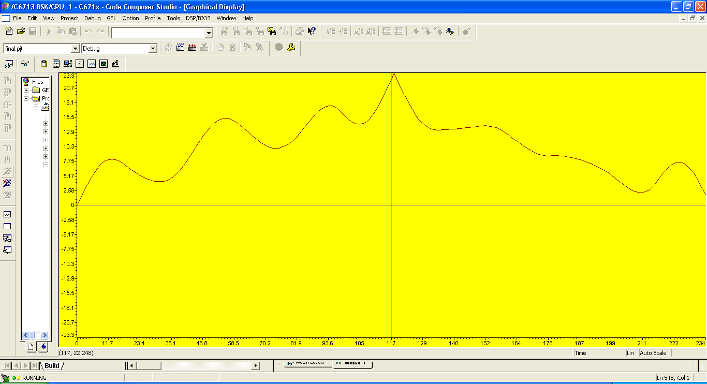{width="6.759444444444444in"
height="2.875in"}

Figure 42: Correlation
with Database signal 3:

**Max Correlation Value Noted: 23.26266**

#### Correlation with Database signal 4:

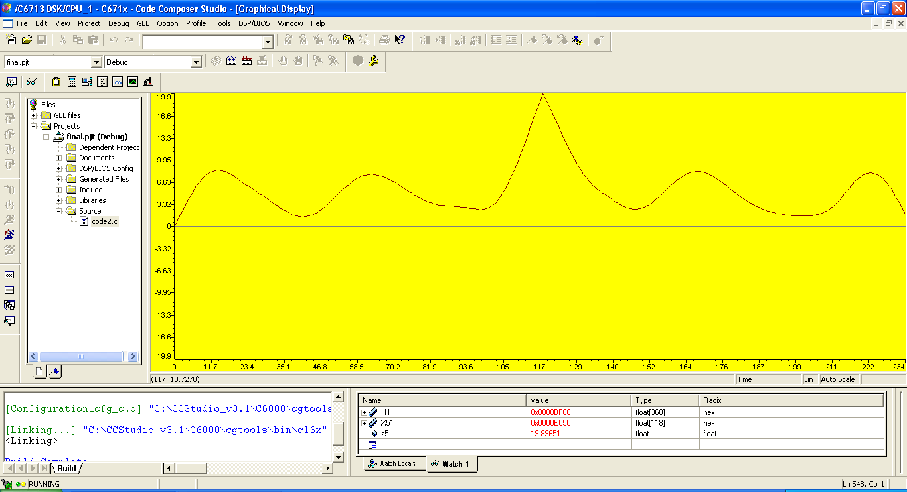{width="6.802083333333333in"
height="2.875in"}

Figure 43: Correlation
with Database signal 4:

**Max Correlation Value Noted: 19.89651**

#### 

#### Output shown on LCD display through 8051

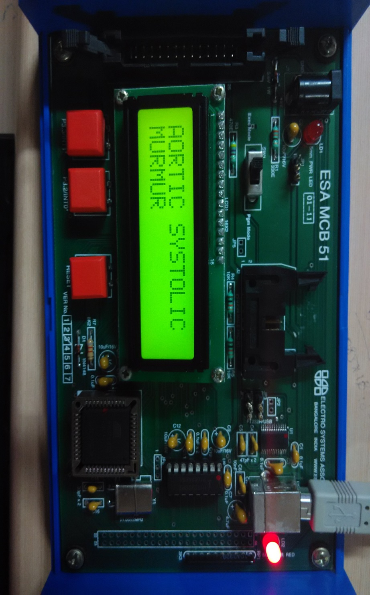{width="3.748990594925634in"
height="6.729166666666667in"}

Figure 44: Output shown
on LCD display through 8051

### Conclusion

1.  Maximum correlation is obtained with Database signal 2.

<!-- -->

1.  The input is a diseased heart sound.

2.  The Identified disease is “Aortic Systolic Murmur”, it rightly
    corresponds to the database signal 2 which is “10 Aortic, Sys Click
    & Late Sys Mur, LLD, Bell\_part 10.5.wav”.

3.  

    1.  

    2.  

    3.  

    4.  Standards used in the project 
        ------------------------------

        1.  ### Stethoscope

-   IS 3391 (1965) :This standard lays down the requirements for
    binaural stethoscope used for the detection and study of sounds
    arising within the human or animal body

-   Rubber tubing Conforming to Grade I of IS:637-1955. All
    metal-to-metal joints shall be of the Luer lock type conforming to
    the dimensions specified in IS :3234-1965.

-   Finish-All brass parts shall be chromium plated over nickel
    conforming to Grade C of IS:1068-1958.

    1.  ### Collar microphone

<!-- -->

-   Frequency Range: 180-220 MHz.

-   S/N Ratio &gt; 100 dB

    1.  ### UART (Universal Asynchronous Receiver transmitter)

<!-- -->

-   It is based on industry standard TL16C550 asynchronous communication
    element which is a functional upgrade of the TL16C450.

-   Physical layer standard is RS232 communication which is between a
    DTE (Data Terminal Equipment) i.e., computer COM (Communication)
    port and DCE (Data Communication Equipment) i.e., modem port

    1.  ### IEEE754 is technical standard for floating point computation.

CHAPTER V: SCHEDULES, TASKS AND MILESTONES
==========================================

There were four major milestones in this project.

-   Hardware Signal Conditioning Circuit Implementation

-   Developing algorithm for classifying the sounds in MATLAB

-   Conversion of MATLAB implemented functions into C code to dump
    into DSK6713.

-   Recording Abnormal Heart sounds in real time and denoising the
    signal in DSK6713

Tasks were split up among group members according to each member’s level
of expertise or comfort. Each task will have a leader who is responsible
for completion of that task. However, the other group members are
expected to provide assistance if needed. This way, an engineer can
concentrate on a task but still get help if needed. Also, each tasks\`
respective leader is held accountable if the task fails.

CHAPTER VI: PROJECT DEMONSTRATION
=================================

The most important specification that the Clinical Heart Disease
Diagnosis System has to meet is to be competitive against an experienced
cardiologist while still being an autonomous system. Therefore the
primary project demonstration has to be performed on real time over a
healthy as well as a diseased patient. The constraints of the
demonstration are the failure to denoise the extra evident ambient noise
present while performing the analysis.

Building the entire system in real time, with all possible real time
constraints taken into consideration, like the absence of a person with
a heart disease, it is a little impractical to have the live
demonstration with an unhealthy patient. Therefore a video of the
demonstration will be shown.

CHAPTER VII: COST ANALYSIS
==========================

This is a detailed cost analysis on the required parts for the Clinical
Heart Monitoring System.

***Parts Cost of each part(In Rs) ***

1.  Stethoscope 7000

2.  Collar Microphone 1000

3.  DSK6713 Starter Kit 22000

4.  ESA MCB 51 Kit 1500

5.  Other Components 500

> **Total…………………………………….32000**

CHAPTER VIII: SUMMARY
=====================

The system that has been developed involves ambient noise reduction
techniques, sound amplification and analysis. Analysis of the recorded
auscultation sounds is performed by using stochastic algorithms (i.e.
correlation) on a database of recorded heart sounds collected from
Michigan Heart Library. The analysis included identification of a
probable heart disease. The system which has been designed contained
three modules. A stethoscope, a Signal Conditioning unit and the
Analysis and Comparison unit. The processor that has been used is
DSK6713 which takes the audio input via a microphone which is fixed into
a cardiac stethoscope. The sound has then been cleansed and amplified.
This amplified sound had then been compared to the database sounds. The
system correctly identified the patient’s state of the heart, i.e.,
diseased or normal - if diseased, what is the possible heart disease and
where the abnormality is occurring.

CHAPTER IX: REFERENCES
======================

1.  Written by Hutchison edited by Michael Glynn and William M Drake ,“
    Hutchison's Clinical Methods,” 23rd Edition An Integrated Approach
    to Clinical Practice With student consult Online Access ,Pub
    Date: 2012 , Publisher: Saunders Ltd.

<!-- -->

1.  Rulph Chassaing, “DSP Applications Using C and the TMS320C6x
    DSK**,**” A Wiley–Interscience Publication,Published:Januray2002.

2.  Indu Udai , Lekshmi P R , Sherin K Mathews , Tinu Maria Daie and
    Manu T S. “ECG Signal Processing Using DSK TMS320C6713,” IOSR
    Journal of Engineering (IOSRJEN) Volume 2, Issue 10 (October 2012),
    PP 24-43 .

3.  R. M. Potdar and Nishi Shahnaj Haider “Removal of Heart Sound from
    Lung Sound using LabVIEW 8.6, ” International Journal of Engineering
    Research and Applications (IJERA) Vol. 2, Issue 3, May-Jun 2012,
    pp.1313-1319 1313.

4.  Anas Mohd Noor, Mohd Faiz Shadi ” The Heart Auscultation. From Sound
    To Graphical,” Journal of Engineering and Technology ,2013.

5.  Zaiton Sharif, Mohd Sharmian Zainal, , Ahmad Zuri Shaameri andSheikh
    Hussain Shaikh Salleh” Analysis And Classification Of Heart Sounds
    And Murmurs Based On Tee Instantaneous Energy And Frequency
    Estimations,*”*IEEE Conference,2000*.*

6.  Masaru Yamashita, Masataka Himeshima, and Shoichi Matsunaga
    *“*Robust Classification Between Normal And Abnormal Lung Sounds
    Using Adventitious-Sound And Heart-Sound Models*”,* IEEE
    International Conference on Acoustic, Speech and Signal
    Processing (ICASSP),2014.

7.  Database heart sound from “University of Michigan Heart Sound and
    Murmur Library”\[Online\]Available at
    <https://www.umms.med.umich.edu/psb/>.

Appendix A
==========

Gantt Chart {#gantt-chart .ListParagraph}
-----------

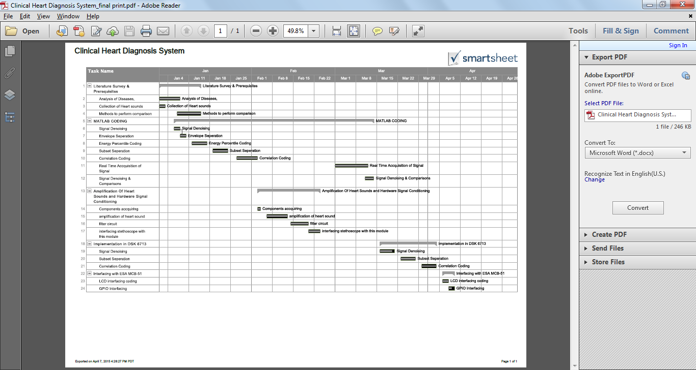{width="6.88286198600175in"
height="6.03125in"}

Figure 45: Gantt Chart
